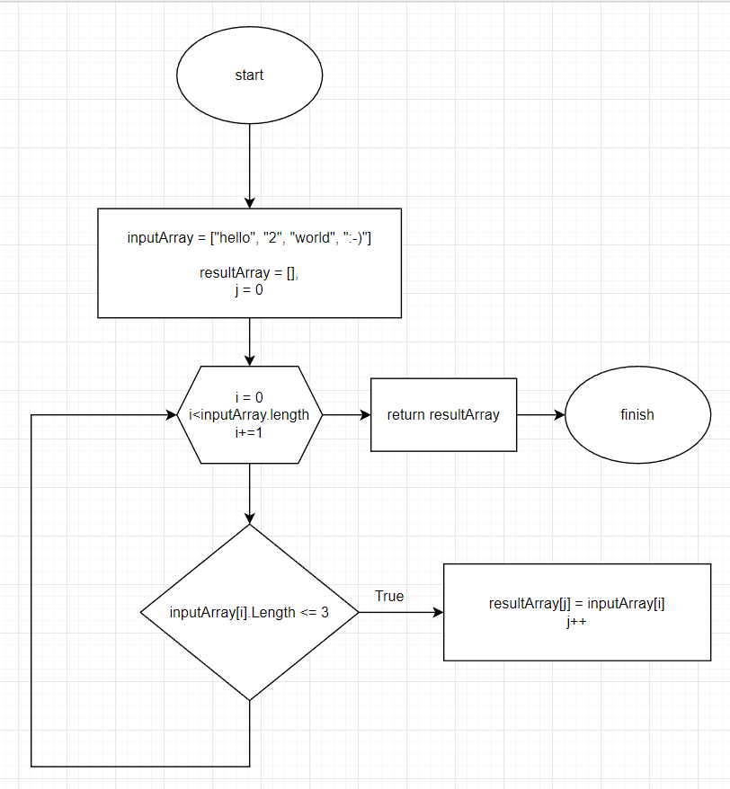

# Итоговая проверочная работа

Вся программа разбита на три метода: *GetNewLen*, *GenerateNewArray* и *PrintArray*.

Метод GetNewLen предназначен для вычисления длины нового массива, где будут хнанится строки с длиной <= 3. Метод GenerateNewArray на основе входного массива и длины массива для строк с длиной <= 3 формирует и возвращает новый массив. А метод PrintArray выводит на печать весь массив.

Ниже представлена блок-схема алгоритма метода основного GenerateNewArray:

